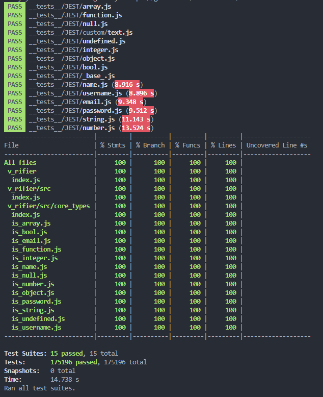

# v_rifier

Data V[a]rifier => v_rifier 😁

## 🔻 Beta STATE 001...0 xD

## 📚 How to use

    const v_rifier = require('v_rifier');
    let myVerifier = await v_rifier();

Built-in modules:
> NOTE: Don't forget to add **await** before any of the following verification methods are called.

1. **array**  
Array Checker

        myVerifier.isArray([1,2,3]) //> true

2. **bool**  
Boolean Checker

        myVerifier.isBool(true) //> true
        myVerifier.isBool(false) //> true

        myVerifier('bool', true) //> true
        myVerifier('bool', false) //> true

        myVerifier.isBool(112) //> false
        myVerifier('bool', 0) //> false
        myVerifier.isBool("true") //> false
        myVerifier('bool', "true") //> false

3. **color**  
Color Checker that will verify if provided string is valid color in RGB, RGBA and hex format.

        // RGB
        myVerifier.isColor("25,25,25") //> true
        // RGBA
        myVerifier.isColor("25,25,25,.58") //> true
        
        // Hex
        myVerifier.isColor("#CBA") //> true
        myVerifier.isColor("#CBA5") //> true
        myVerifier.isColor("#FF00CC") //> true
        myVerifier.isColor("#FF00CC50") //> true
        
        // Invalid Colors
        myVerifier.isColor("0,0,0,-.58") //> true
        myVerifier.isColor("FF00CC50") //> false

4. **email**  
Email Checker

        myVerifier.isEmail('slavko.vuletic92@gmail.com') //> true
        myVerifier('email','slavko.vuletic92@gmail.com') //> true

5. **function**  
Function Checker

        const sampleFunc = async () => {
          return console.log('yea');
        };

        myVerifier.isFunction(sampleFunc) //> true
        myVerifier('function', sampleFunc ) //> true

6. **hexadecimal**  
Hexadecimal Checker - returns true if provided string is a hexadecimal number.

        myVerifier.isHexadecimal( 'FAc0516' ) //> true
        myVerifier('hexadecimal', 1561313 ) //> false

7. **integer**  
Integer Checker

        myVerifier.isInteger( 123 ) //> true
        myVerifier('integer', 984351 ) //> true

8. **name**  
Name Checker

        myVerifier.isName( "Slavko Vuletic" ) //> true
        myVerifier('name', 123 ) //> false

9. **npmVersion**  
npmVersion Checker

        myVerifier.isNull( "1.2.1" ) //> true
        myVerifier('null', "55.798.15" ) //> true

        myVerifier.isNull( 123 ) //> false
        myVerifier('null', "55.-798.15" ) //> false
        myVerifier('null', "55.-798.15-" ) //> false

10. **null**  
Null Checker

        myVerifier.isNull( null ) //> true
        myVerifier('null', null ) //> true

11. **number**  
Number Checker

        myVerifier.isNumber( 123 ) //> true
        myVerifier('number', 123 ) //> true

12. **object**  
object Checker

        myVerifier.isObject( { name: "yea" } ) //> true
        myVerifier('object', 123 ) //> false

13. **password**  
password Checker - Verify password with confirmation password and returns true if password is valid [length & characters].

        myVerifier.isPassword( 'MyPassword123', 'MyPassword123' ) //> true
        myVerifier('password', 'MyPassword123', 'MyPassword123' ) //> true

        myVerifier.isPassword( 'MyPassword123', 123 ) //> false
        myVerifier('password', 'MyPassword123' ) //> false

14. **port**  
PORT Checker

        myVerifier.isPort( 8000 ) //> true
        myVerifier('port', 8000 ) //> true

        myVerifier.isPort( -8000 ) //> false
        myVerifier('port', 8000000 ) //> false

15. **string**  
string Checker

        myVerifier.isString( "random String" ) //> true
        myVerifier('string', "random String" ) //> true

        myVerifier.isString( 123 ) //> false
        myVerifier('string', 123 ) //> false

16. **undefined**  
undefined Checker

        myVerifier.isUndefined(  ) //> true
        myVerifier('undefined', undefined ) //> true

        myVerifier.isUndefined( 11 ) //> false
        myVerifier('undefined', "undefined" ) //> false

17. **username**  
username Checker

        myVerifier.isUsername( 123 ) //> true
        myVerifier('username', 123 ) //> true

## 🚀 Advanced Usage

### 1. Register Custom Type

        await myVerifier.register("myType", (value) =>  value > 100 );

    So now you can use myVerifier.**isMyType**(val) to check if value is greater than 100.

        await myVerifier.isMyType(200) //> true

    Or you can use myVerifier("**myType**", val) to check if value is greater than 100.

        await myVerifier('myType', 200) //> true

### 2. Unregister Custom Type

    await myVerifier.unregister("myType");

### 3. Disable Loading of the Built-in Verification Functions

    let myEmptyVerifier = await v_rifier({ builtIns: false });

### 4. Only Custom Types

After loading module, you can create your custom validation type without even loading built-ins. This provides the ability to create and use only your own custom types.

    const v_rifier = require('..');

    (async () => {
      let sampleVerifier = await v_rifier({ builtIns: false });

      console.log(await sampleVerifier.listTypes()); //> []

      // Create a custom type
      console.log(await sampleVerifier.register('customType', async (value) => (!isNaN(value) && value > 0))); //> true

      console.log(await sampleVerifier.listTypes()); //> [ 'customtype' ]

      // Use it

      // One way...
      console.log(await sampleVerifier('customType', 123)); //> true
      console.log(await sampleVerifier('customType', -123)); //> false

      // Or other way...
      console.log(await sampleVerifier.isCustomType(123)); //> true
      console.log(await sampleVerifier.isCustomType(-123)); //> false

      // Or Unregister It (if you want)
      console.log(await sampleVerifier.unregister('customType')); //> true

      console.log(await sampleVerifier.listTypes()); //> []

    })();

### 5. Or a combination of built-ins and custom types

Main usecase basically, where you would want to check on something like a value being a number and also greather than some other value...while not caring about it being empty/undefined/anything else.

    const v_rifier = require('..');

    (async () => {
      let demoVerifier = await v_rifier();

      // Create a custom type
      console.log(await demoVerifier.register('customType', async (value) => (await demoVerifier('number', value) && value > 0))); //> true

      // Or other way...
      console.log(await demoVerifier.isCustomType(123)); //> true
      console.log(await demoVerifier.isCustomType(-123)); //> false

      console.log(await demoVerifier.isCustomType("-123")); //> false

    })();

## **✅ Tests and Coverage with Jest**

